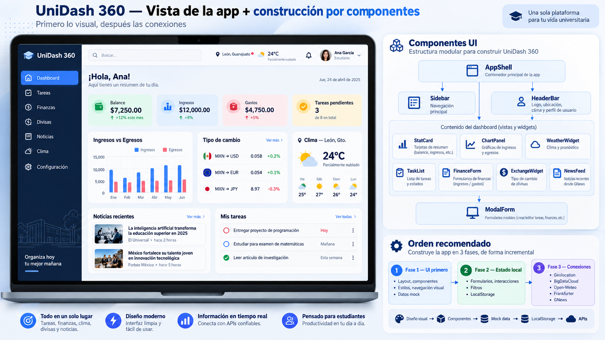

# Arquitectura visual



## Componentes lógicos

```text
AppShell
├── Sidebar
├── HeaderBar
└── Views
    ├── Dashboard
    │   ├── StatCards
    │   ├── FinanceChart
    │   ├── TaskList
    │   ├── ExchangeWidget
    │   ├── WeatherWidget
    │   └── NewsPreview
    ├── TasksView
    ├── FinanceView
    ├── AnalyticsView
    ├── CurrencyView
    └── NewsView
```

En vanilla JavaScript un “componente” puede ser una función que recibe datos y produce/actualiza DOM. No necesitamos React o Vue para practicar separación de responsabilidades.

## Regla de diseño

Los módulos deben recibir datos con una forma estable. En sesiones posteriores cambiaremos **de dónde vienen**, no **cómo se visualizan**.
